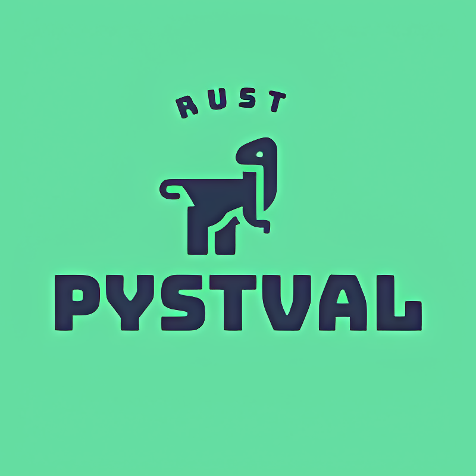

# Pystval 


---
<p align="center">
  <kbd>
    
  </kbd>
</p>

---
**Pystval** is a tool for checking templates against specified rules. It is designed for use in *Python* projects and provides a way to check text data for specified patterns and to enforce certain rules.

If you need to check email addresses, password complexity, or ensure correct formatting, **Pystval** allows you to define custom rules and apply them to your templates.

Thanks to its flexible and extensible architecture, you can easily integrate **Pystval** into your development workflow and ensure data consistency and compliance for your project.


# Contents
- [Pystval](#pystval)
- [Contents](#contents)
  - [Supported systems](#supported-systems)
  - [Installing](#installing)
  - [Using](#using)
    - [Regex Format](#regex-format)
    - [Basic error pattern](#basic-error-pattern)
    - [New errors](#new-errors)
  - [Additional features](#additional-features)

## Supported systems

|                     | Linux                     | Windows                 | macOS                |
| ------------------- | ------------------------- | ----------------------- | -------------------- |
| System architecture | x86_64-unknown-linux-gnu  | x86_64-pc-windows-msvc  | aarch64-apple-darwin |
|                     | aarch64-unknown-linux-gnu | aarch64-pc-windows-msvc | x86_64-apple-darwin  |


## Installing

```bash
pip install pystval-*.whl
```

## Using

Import the desired items

```python
import pystval
from pystval import TemplateValidator, It
```
### Regex Format

Since all calculations using regex take place in rust, it is necessary to follow the format of regex for `Rust` 
- [`regex`](https://docs.rs/regex/latest/regex/)
- [`fancy regex`](https://docs.rs/fancy-regex/latest/fancy_regex/)


---
### Basic error pattern

Create a base error class, which is just a template for future new errors
<details>
<summary>Error Template</summary>

```python
class BaseError(Exception):
    template = ""

    def __init__(self, message: str = None, rules: dict[str, enumerate] = None, **extra):
        self._extra = extra
        self._rules = rules
        if message is None:
            self._message = self.template.format(**extra)
        else:
            self._message = message.format(**extra)

    @property
    def message(self):
        return self._message

    @property
    def extra(self):
        return self._extra

    @property
    def rules(self):
        return self._rules
```
</details>

---
### New errors

Create any errors with any rules, each class can store from one to several rules. For each rule (regular expression) you can set a check condition :
- `MustBeFoundHere` - Must be found, otherwise an exception will be thrown
- `NotToBeFoundHere` - Must not be found, otherwise an exception will be thrown

```python

class MissingElementAvatar(BaseError):
    template = ":: The `avatar` element was not found"
    rules = {
        r"""(?s)""": It.MustBeFoundHere,
    }

class MissingElement1..99
# some rules with the message

# some code
    try:
        await validator_sample.validate(text)
    except BaseError as e:
        print(f"error message: '{e.message}'")
# some code
```

## Additional features

The validator provides additional features, such as defining additional values and getting data from errors. You can learn more about them in the documentation.

Use variables in strings with named regex group. If the rule works, we can fill the message with data from the rule

```python
# text - This dog is a good boy. This dog is a bad boy
class BadWords(BaseError):
    template = "this text should not contain : {bad}"
    rules = {
        r"(?P<bad>bad boy)": NotToBeFoundHere,
    }

# some code
    try:
        await validator_sample.validate(text)
    except BaseError as e:
        print(f"error message: '{e.message}'")
# some code

```
> output : `this text should not contain : bad boy`

