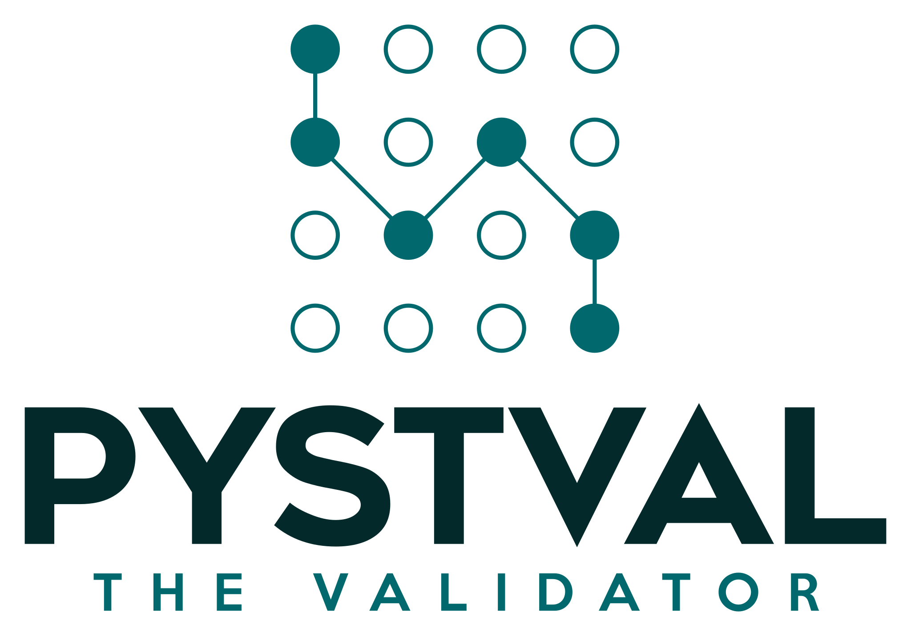

# Pystval 

<p align="center">
  <kbd>
    
  </kbd>
</p>

- [Pystval](#pystval)
  - [The Library](#the-library)
  - [Quick Look](#quick-look)
  - [Installation](#installation)
  - [Regex Syntax](#regex-syntax)
  - [License](#license)


## The Library

**Pystval** is a powerful `Rust` library for text validation and analysis. It allows you to create custom errors with modifiers and define sub-corrections for each rule. With Pystval, you can build versatile validators that handle any text and enforce specific requirements. Customize error behavior and apply sub-corrections based on specific cases or conditions. Pystval empowers you to create accurate and adaptable validators for various text processing needs.

## Quick Look

```python
from pystval import Rule, MatchRequirement, TemplateValidator, PystvalException


class ErrorInvalidFormat(PystvalException):
    message = "Custom error 1"
    rules = [
        # root rule
        Rule("(?i)abc.+\d+", MatchRequirement.MustBeFound).extend([
            # 1-subrule of root rule
            Rule("\d{3}-\d{4}-\d{2}", MatchRequirement.MustBeFound).extend([
                # 1-subrule of 1-subrule
                Rule("^\d{3}", MatchRequirement.MustBeFound).extend(
                    # 1-subrule of 1-subrule of 1-subrule
                    [Rule("[0-1][1-2][1-3]", MatchRequirement.MustBeFound)]),
                # 2-subrule of 1-subrule
                Rule("-", MatchRequirement.MustBeFound),
            ]),
        ])
    ]


class ErrorNumber(PystvalException):
    message = "Custom error with value : {num}"
    rules = [
        Rule(r"(?<num>\d+(?!\d|-|\s))", MatchRequirement.MustNotBefound)
    ]


def main():
    text = b"This is a complex text with aBc_122-4567-99 and def. The number is 12345"
    validator = TemplateValidator([ErrorInvalidFormat, ErrorNumber])
    list_error = validator.validate(text)
    if list_error is not None:
        for error in list_error:
            try:
                raise error
            except PystvalException as e:
                print(e.report)


main()
```
> **Output**:
> Custom error with value : 12345

## Installation

To install the latest version of Pystval, use the following command:
```bash
pip install pystval-version-platform.whl
```
**Supported Platforms**:

|                     | **Linux**                   | **Windows**               | **macOS**              |
| ------------------- | --------------------------- | ------------------------- | ---------------------- |
| System architecture | `x86_64-unknown-linux-gnu`  | `x86_64-pc-windows-msvc`  | `aarch64-apple-darwin` |
|                     | `aarch64-unknown-linux-gnu` | `aarch64-pc-windows-msvc` | `x86_64-apple-darwin`  |

## Regex Syntax

When the `Rule` is created, the complexity of the rule is determined based on the presence of leading and retrospective checks in the regular expression. Below is a description of how the library classifies the complexity of a rule:

 - Fancy Regex: If a regular expression contains leading or retrospective checks (lookahead/lookbehind), the rule is considered "fancy". This is because lookahead and lookbehind checks require more complex processing algorithms and can have high computational complexity.

- Default Regex: If a regular expression does not contain leading or retrospective checks, it is considered "default". In this case, the default regular expression algorithm is used, which usually has lower computational complexity.

When creating rules without leading or retrospective checks, `RegexSet` is used. `RegexSet` allows you to compile and combine many regular expressions into a single data structure, which can have a positive impact on performance when doing mass match checking.

More information on syntax :
- [Default-Regex](https://docs.rs/regex/latest/regex/#syntax)
- [Fancy-Regex](https://docs.rs/fancy-regex/latest/fancy_regex/#syntax)
Or
- [the same as those links, but with only a syntax table ](docs/syntax_regex/regex.md)

## License

Pystval is licensed under the [MIT License](LICENSE).